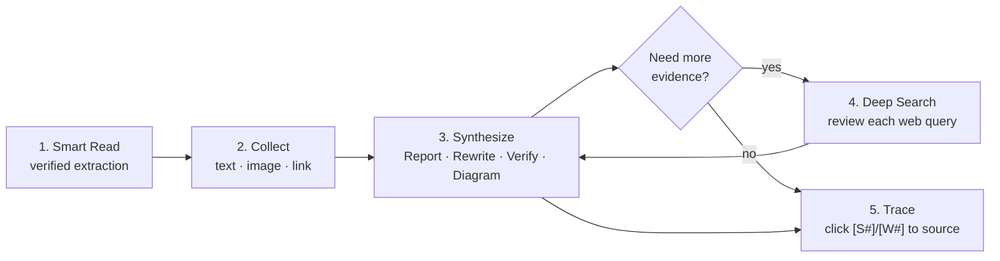
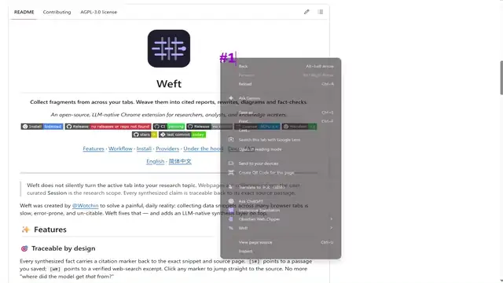

<div align="center">


# Weft

**Collect fragments from across your tabs. Weave them into cited reports, rewrites, diagrams and fact-checks.**

*An open-source, LLM-native Chrome extension for researchers, analysts, and knowledge workers.*

[](#-install)
[](https://github.com/wotchin/weft/releases/latest)
[](https://github.com/wotchin/weft/actions/workflows/ci.yml)
[](https://github.com/wotchin/weft/actions/workflows/release.yml)
[](LICENSE)
[](https://developer.chrome.com/docs/extensions/mv3/intro/)
[](https://github.com/wotchin/weft/stargazers)
[](https://github.com/wotchin/weft/commits/main)

[Features](#-features) · [Workflow](#-core-workflow) · [Install](#-install) · [Providers](#-supported-providers) · [Under the hood](#where-engineering-rigor-lives) · [Docs](#-documentation) · [FAQ](#-faq)

[English](README.md) · [简体中文](README.zh-CN.md)

</div>

---

> **Weft does not silently turn the active tab into your research topic.**
> Webpages are collection points; the user-curated **Session** is the research scope.
> Every synthesized claim is traceable back to its exact source passage.

Weft was created by [@Wotchin](https://thejackstudio.com) to solve a painful, daily reality:
collecting data snippets across many browser tabs is slow, error-prone, and un-citable.
Weft fixes that — and adds an LLM-native synthesis layer on top.

## ✨ Features

### 🎯 Traceable by design
Every synthesized fact carries a citation marker back to the exact snippet and source page.
`[S#]` points to a passage you saved; `[W#]` points to a verified web-search excerpt.
Click any marker to jump straight to the source. No more "where did the model get *that* from?"

### 🧵 Session-first research
A **Session** is your curated research scope. Ask questions across what you
intentionally saved, then extend it via **Deep Search** to find primary sources,
counterpoints, and updates. Weft never silently promotes the active tab into scope.

Sessions can be exported as readable HTML and imported back into Weft. New exports
carry a versioned, inert data envelope that preserves portable text, source, PDF and
Smart Read metadata; external image references are restored as safe links instead of
being fetched automatically. Older Weft HTML exports are accepted in a safe
best-effort mode when their visible structure can be recognized.

### 🤖 Bring Your Own Key (BYOK)
Works with **OpenAI, Anthropic, Gemini, DeepSeek, Moonshot, Qwen, local Ollama, any OpenAI-compatible endpoint, or Chrome's built-in on-device AI** (no key needed).
Your key and your snippets stay on your machine — they only ever travel to the endpoint *you* choose.

### 🔍 Lightweight Session-first research agent
Deep Search now runs a bounded, provider-neutral JSON action loop. It starts
with local Session retrieval, can use a dependency-free calculator, and only
asks for an external search when it finds a material evidence gap. Every
external query is shown for review or editing before it runs. There is no
general browser automation, arbitrary clicking, or form submission; without a
search provider, it remains Session-only and makes no web-search request (model
calls still follow the LLM configured in Settings). External excerpts
are cited as `[W#]` alongside `[S#]` Session evidence.

### 📑 Smart Read — source-verified extraction
Run **Smart Read** on an article or a text-layer HTTP(S) PDF to build a new focused
Session from key passages. Every quoted passage is **checked against the extracted
source** before it is saved, so hallucinated evidence is silently dropped. PDF
passages retain their page number. You can also select PDF text manually: the
same compact bar used on web pages offers Save, Verify, Explain, Key points and
Ask. **Show on Page** opens the optional local Weft PDF Reader, where saved
passages can be shown or hidden and new selections can be captured. On
link-heavy pages, tell Weft what matters first and it shortlists only the visible,
relevant links. Weft never replaces Chrome's built-in viewer or registers itself
as the default PDF handler. When another viewer exposes the original HTTP(S) URL,
Weft safely recovers that source without entering or modifying the other extension.

### 🧩 Synthesis scenarios
One-click scenarios turn raw snippets into specific deliverables:
**Report · Rewrite · Verify · Summarize · Compare · Extract · Table · Translate · Diagram (Mermaid)**.

### 🏅 Private & local
Snippets live in `chrome.storage.local` / IndexedDB.
**No telemetry, no account, no third-party tracking.** Weft talks only to the
provider endpoint you configure — there is no Weft server in the path.
See [`PRIVACY.md`](PRIVACY.md).

### 🌍 Localized UI & multilingual answers
Interface available in **English** and **简体中文**. AI replies can be requested in
9 languages (adds French, German, Spanish, Japanese, Korean, Portuguese, Russian) —
picking one of those keeps the English interface and only changes the answer language.

## 🧭 Core workflow



1. **Read** — `Smart Read` an article or text-layer PDF to seed a focused Session. Web passages can be highlighted in place; PDF passages can be reviewed and manually captured in the explicit Weft PDF Reader without taking over Chrome's native viewer.
2. **Collect** — right-click or use the selection toolbar to save more text / image / link snippets.
3. **Synthesize** — open the Workbench side panel; ask the Session a question, or pick a scenario.
4. **Deep Search** — start from a Session question; if the Agent needs outside evidence, review or edit each proposed web query before it runs.
5. **Trace** — click any citation to open its source passage or external link.

### 🎬 Quick demo

[](assets/3.0.2-beta-demo.mp4)

_The inline preview is accelerated and silent. Click it to open the full-quality MP4, or [download the video directly](assets/3.0.2-beta-demo.mp4)._

> The installer also embeds this clip on the welcome page so new users can watch the core flow before configuring anything.

## 🚀 Install

### Option A — Store (recommended when available)
Available soon on the Chrome Web Store. Until then, use the dev build below.

### Option B — Load unpacked (development / sideload)

1. Download the latest `weft-<version>.zip` from [Releases](https://github.com/wotchin/weft/releases/latest) and unzip it, or clone this repo.
2. Open `chrome://extensions` → enable **Developer mode**.
3. Click **Load unpacked** → select the unzipped folder (or this repo).
4. Open **Settings** → pick a provider → paste your key (or pick Ollama / Chrome built-in AI) → **Test Connection**.

> 💡 Pin Weft to the toolbar, then open it via the side panel (right-click the icon → *Open side panel*) for a persistent Workbench.

## 🔌 Supported providers

| Provider | Key needed | Notes |
|---|---|---|
| OpenAI | ✅ | GPT-4o / o-series, vision supported |
| Anthropic | ✅ | Claude 3.5 Sonnet / Haiku |
| Google Gemini | ✅ | Multimodal |
| DeepSeek | ✅ | Cheap reasoning |
| Moonshot (Kimi) | ✅ | Long context |
| Qwen (Alibaba) | ✅ | via DashScope OpenAI-compatible mode |
| Ollama | ❌ | Local, fully offline |
| OpenAI-compatible | ✅ | Any endpoint exposing the OpenAI schema |
| **Chrome built-in AI** | ❌ | On-device; nothing leaves your browser |

Base URL and model name are pre-filled per provider and fully overridable in Settings.

## 🛠️ Architecture

Weft is intentionally **vanilla JS, Manifest V3, no build step, no framework**.
What you see is what runs in the browser.

| Layer | Files | Role |
|---|---|---|
| UI / Workbench | `chat.js`, `popup.js`, `settings.js`, `onboarding.js` | Side panel, popup, settings, onboarding |
| Rendering | `markdown.js`, `lib/render.js`, `lib/diagram-generator.js` | Markdown + citation + Mermaid rendering |
| LLM layer | `lib/llm-client.js`, `lib/providers.js` | Multi-provider chatting, JSON mode, streaming |
| Retrieval | `lib/rag-engine.js`, `lib/rag-indexer.js`, `lib/bm25.js`, `lib/vector-index.js`, `lib/tokenizer.js` | Hybrid BM25 + embedding RAG |
| Extraction | `lib/page-extractor.js`, `lib/pdf-extractor.js`, `lib/smart-read.js`, `lib/highlighter.js` | Web/PDF extraction, source verification, on-page highlighting |
| Agent | `lib/agent-runner.js`, `lib/agent-tools.js` | Bounded JSON actions, local Session retrieval and deterministic calculations |
| Search | `lib/search-provider.js` | User-approved SearXNG / Tavily / Brave searches |
| Persistence | `lib/store.js`, `lib/idb.js` | chrome.storage + IndexedDB sessions, chat, images |
| i18n | `lib/i18n.js`, `_locales/` | UI + AI-output language |
| Safety | `lib/sanitize.js`, `lib/citations.js` | HTML sanitization, citation contract |
| Background | `background.js`, `content-assist.js` | Service worker, page-level content scripts |

### Where engineering rigor lives

- **Hybrid RAG** with token-budget-aware retrieval (`rag-engine.js`) — picks the right evidence without blowing the context window.
- **Source verification** before any Smart Read snippet is saved — `smart-read.js` rejects quoted passages not found in the rendered source, so hallucinated evidence never enters your Session.
- **Concurrency-safe storage** — `lib/store.js` serializes all session writes via Web Locks (+ a cross-context promise queue), so the side panel, popup, and service worker cannot trample each other.
- **Stream-safe, recoverable chat** — `processStream` in `chat.js` handles truncation recovery and maps streaming tokens to citation indices without re-parsing per token.
- **Citation contract** — `lib/citations.js` enforces a strict marker grammar (`[S#]`, `[W#]`), keeping every AI claim auditable.
- **Prompt hygiene** — internal scenario prompts are never persisted or echoed back; only the user-facing intent label is stored (see `chat.js` ↔ `lib/store.js`).

## 📚 Documentation

| Topic | File |
|---|---|
| 📜 Privacy policy | [`PRIVACY.md`](PRIVACY.md) |
| 🤝 Contributing guide | [`CONTRIBUTING.md`](CONTRIBUTING.md) |
| 📋 License (AGPL-3.0) | [`LICENSE`](LICENSE) |
| 🚦 CI / CD | [`.github/workflows/ci.yml`](.github/workflows/ci.yml), [`.github/workflows/release.yml`](.github/workflows/release.yml) |

## ❓ FAQ

**Does Weft send my data to anyone?**
No. Snippets and your key stay in `chrome.storage.local` / IndexedDB. The only time snippet/text content leaves your machine is when *you* run a synthesis action — and it goes only to the LLM provider *you* configured. See [`PRIVACY.md`](PRIVACY.md).

**Can I use this without an API key?**
Yes — pick **Ollama** (local LLM) or **Chrome built-in AI** (on-device) in Settings. Nothing leaves your machine.

**Does it work in Firefox / Edge?**
Currently Chrome/Chromium-only. We track MV3 cross-browser compatibility and will add Edge/Firefox when their side-panel APIs stabilize.

**Is it free?**
Yes. The extension is free and open source under AGPL-3.0, and the bring-your-own-key
workflow will stay that way. The only thing you pay for is your own model provider.

## 🤝 Contributing

PRs and issues are very welcome! Weft is vanilla-JS MV3, so the dev loop is fast:

```bash
npm install          # dev tooling only (eslint, prettier)
npm run check        # validate manifest + lint + unit tests
npm run format       # prettier
npm run pack         # build the store-ready zip (needs the `zip` command)
```

See [`CONTRIBUTING.md`](CONTRIBUTING.md) for details, and open an [issue](https://github.com/wotchin/weft/issues/new) if you want to discuss a feature before coding.

## ⭐ Show your support

If Weft saves you time, please **star this repo** — it helps other researchers discover it, and keeps the project maintained.

## 📝 License

[GNU Affero General Public License v3.0](LICENSE) © [@Wotchin](https://thejackstudio.com).

You can use, modify and self-host Weft freely. AGPL-3.0 asks that if you distribute
a modified version — or run one as a network service — you publish your changes
under the same licence.

If your organisation cannot accept copyleft terms, a separate commercial licence is
available: [get in touch](https://thejackstudio.com).

<div align="center">

<sub>Built with ❤️ for everyone who collects evidence across too many tabs.</sub>

</div>
