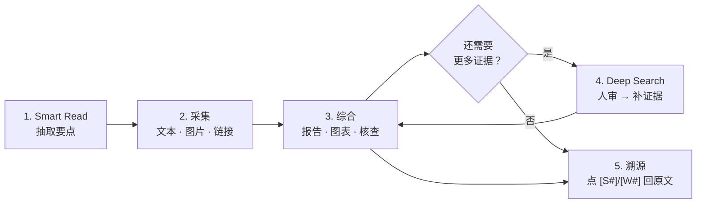

<div align="center">


# Weft

**把网页片段采集、综合成带引用产出的 LLM-Native Chrome 插件。**

支持 Smart Read 抽取、跨标签页采集、九种综合场景（报告 / 对比 / 图表 / 核查 / 翻译…）、以及人审流程的 Deep Search——所有结论都带 `[S#]`/`[W#]` 引用证据，可回溯原文。

[](#-安装)
[](https://github.com/wotchin/weft/releases/latest)
[](https://github.com/wotchin/weft/actions/workflows/ci.yml)
[](https://github.com/wotchin/weft/actions/workflows/release.yml)
[](LICENSE)
[](https://developer.chrome.com/docs/extensions/mv3/intro/)
[](https://github.com/wotchin/weft/stargazers)
[](https://github.com/wotchin/weft/commits/main)

[特性](#-特性) · [工作流](#-工作流) · [安装](#-安装) · [服务商](#-支持的服务商) · [技术内核](#-技术内核) · [文档](#-文档) · [常见问题](#-常见问题)

[English](README.md) · [简体中文](README.zh-CN.md)

</div>

---

## ✨ 特性

- **每条引用都能点回原文。** AI 生成的每句话都带 `[S1]`、`[W2]` 这样的标记：`S` 指向你保存的原文片段，`W` 指向 Deep Search 抓回的网页片段，点击跳转到来源。
- **Session 是回答边界。** Weft 只在当前 Session 的片段范围内回答，不会把整张网页当作研究主题。证据不够时再通过 Deep Search 主动补。
- **Session 可迁移。** 工作台可把当前 Session 导出为便于阅读的 HTML，也可将其重新导入 Weft。新导出文件内含独立版本号和惰性结构化数据，可恢复文本、来源、PDF 与 Smart Read 元数据；外部图片引用会转成安全链接，不会在导入后被自动下载。旧版 Weft HTML 在可识别时会以安全的尽力模式导入。
- **Smart Read** 可从文章或带文字层的 HTTP(S) PDF 抽取要点建立新 Session；每条摘要在保存前都会反查提取后的源文，找不到出处的丢弃，PDF 片段还会保留页码。Weft 与 Chrome 原生预览器并存；若其他 PDF 扩展把标签页改成其私有的 `chrome-extension://` 地址，受 Chrome 跨扩展隔离限制，Weft 无法读取。
- **Deep Search** 是一个受限的 Session-first 研究 Agent：先在本地检索 Session，必要时调用无依赖计算工具；只在发现实质证据缺口时才提议外部搜索，且每条查询都要先经你审阅或修改。它不提供任意点击、表单提交等通用浏览器自动化；未配置搜索服务时不会发起网页搜索，模型调用仍遵循 Settings 中配置的 LLM。
- **九种综合场景**：报告、重写、事实核查、摘要、对比、信息抽取、表格、翻译、Mermaid 图表，一键产出。
- **自带密钥（BYOK）或免密。** 兼容 OpenAI / Anthropic / Gemini / DeepSeek / Moonshot / Qwen / Ollama / OpenAI 兼容端点 / Chrome 内置 AI。
- **数据全部留在本机。** 片段、聊天历史、密钥存于 `chrome.storage.local` / IndexedDB，无账号、无遥测、无第三方追踪。本地模型可完全离线。详见 [`PRIVACY.md`](PRIVACY.md)。
- **界面支持 English 与简体中文；AI 回答支持 9 种语言**（英、中、法、德、西、日、韩、葡、俄），界面语言与回答语言可独立选择。

## 🧭 工作流



操作步骤：

1. 对长文或带文字层的 PDF 运行 **Smart Read** 建立聚焦 Session；网页片段可用 **Show on Page** 标注，PDF 片段则会跳转到对应页码（Chrome 原生 PDF 预览器不支持 Weft DOM 标注）。
2. 在其他标签页选中文本、图片、链接，右键存入同一 Session。
3. 打开侧边栏 Workbench，向当前 Session 提问或选择综合场景。
4. 证据不足时对问题运行 Deep Search；Agent 如需外部证据，会先让你逐条审核或修改联网查询。
5. 回答中的任何引用标记都可点击跳转到来源。

### 🎬 快速演示

[](assets/3.0.2-beta-demo.mp4)

_页面内预览为加速、静音版本。点击预览可打开完整画质 MP4，也可以[直接下载视频](assets/3.0.2-beta-demo.mp4)。_

> 安装时引导页（onboarding）也会嵌入这段视频，让新用户在不配置任何东西前先看到核心流程。

### 方式 A — Chrome 应用商店（上线后）

商店审核中，在此之前请用方式 B。

### 方式 B — 加载已解压的扩展（开发 / 侧载）

1. 从 [Releases](https://github.com/wotchin/weft/releases/latest) 下载 `weft-<version>.zip` 解压，或 `git clone` 本仓库。
2. 打开 `chrome://extensions`，开启「开发者模式」。
3. 点「加载已解压的扩展程序」，选择解压目录或仓库根目录。
4. 打开 **Settings** → 选择服务商 → 填密钥（或选 Ollama / Chrome 内置 AI）→ 点 **Test Connection**。

> 💡 右键工具栏图标 → *Open side panel*，可获得常驻侧边栏 Workbench。

## 🔌 支持的服务商

| 服务商 | 需要密钥 | 备注 |
|---|---|---|
| OpenAI | ✅ | GPT-4o / o 系列，支持视觉 |
| Anthropic | ✅ | Claude 3.5 Sonnet / Haiku |
| Google Gemini | ✅ | 多模态 |
| DeepSeek | ✅ | 推理便宜 |
| Moonshot（Kimi） | ✅ | 长上下文 |
| Qwen（通义千问） | ✅ | 通过 DashScope OpenAI 兼容接口 |
| Ollama | ❌ | 本地，完全离线 |
| OpenAI 兼容 | ✅ | 任何符合 OpenAI schema 的端点 |
| **Chrome 内置 AI** | ❌ | 设备端推理，不联网 |

## 🛠️ 架构

原生 JS + Manifest V3，无构建步骤、无框架。

| 层 | 主要文件 | 负责什么 |
|---|---|---|
| UI | `chat.js`、`popup.js`、`settings.js`、`onboarding.js` | 侧边栏、弹窗、设置、引导 |
| 渲染 | `markdown.js`、`lib/render.js`、`lib/diagram-generator.js` | Markdown、引用、Mermaid |
| LLM | `lib/llm-client.js`、`lib/providers.js` | 多服务商、JSON 模式、流式 |
| 检索 | `lib/rag-engine.js`、`lib/rag-indexer.js`、`lib/bm25.js`、`lib/vector-index.js`、`lib/tokenizer.js` | 混合 BM25 + 向量 RAG |
| 抽取 | `lib/page-extractor.js`、`lib/pdf-extractor.js`、`lib/smart-read.js`、`lib/highlighter.js` | 网页/PDF 抽取、来源校验、页面高亮 |
| Agent | `lib/agent-runner.js`, `lib/agent-tools.js` | 受限 JSON action、本地 Session 检索与确定性计算 |
| 搜索 | `lib/search-provider.js` | 经用户确认的 SearXNG / Tavily / Brave 搜索 |
| 存储 | `lib/store.js`、`lib/idb.js` | chrome.storage + IndexedDB |
| i18n | `lib/i18n.js`、`_locales/` | 界面与回答语言 |
| 安全 | `lib/sanitize.js`、`lib/citations.js` | HTML 消毒、引用契约 |
| 后台 | `background.js`、`content-assist.js` | Service Worker、内容脚本 |

### 技术内核

- **混合 RAG + token 预算**（`rag-engine.js`）：采用浏览器端本地混合RAG技术,按 token 预算挑证据，避免撑爆上下文窗口。
- **摘要反查原文**（`smart-read.js`）：Smart Read 的每条摘要保存前回到渲染源文中找一遍，找不到出处的丢弃，防幻觉片段入库。
- **并发安全的存储**（`lib/store.js`）：所有 Session 写入走 Web Locks（+ 跨上下文 promise 队列兜底），侧边栏、弹窗、Service Worker 同时写不会互相覆盖。
- **流式可恢复**（`chat.js` 的 `processStream`）：断流可续，引用标记在流式过程中实时映射到对应片段，无需收完再解析。
- **引用契约**（`lib/citations.js`）：`[S#]` / `[W#]` 语法被严格解析，每条 AI 论断可审计。
- **Prompt 不落盘**（`chat.js` ↔ `lib/store.js`）：场景模板的内部 prompt 永不入聊天历史也不回显，磁盘上只留用户可见的意图标签，防泄露。

## 📚 文档

| 主题 | 文件 |
|---|---|
| 隐私政策 | [`PRIVACY.md`](PRIVACY.md) |
| 贡献指南 | [`CONTRIBUTING.md`](CONTRIBUTING.md) |
| 许可证（AGPL-3.0） | [`LICENSE`](LICENSE) |
| CI / CD | [`.github/workflows/ci.yml`](.github/workflows/ci.yml)、[`.github/workflows/release.yml`](.github/workflows/release.yml) |

## ❓ 常见问题

**数据会被传出本机吗？**
采用BYOK模式下，片段、历史、密钥存于 `chrome.storage.local` / IndexedDB。仅在你主动运行综合场景（如写报告）时，相关片段会发往你在 Settings 中配置的服务商；全用本地模型时可离线。详见 [`PRIVACY.md`](PRIVACY.md)。

**没有 API 密钥能用吗？**
可以。Settings 中选 **Ollama**（本地 LLM）或 **Chrome 内置 AI**（设备端推理），数据不离开本机。

**支持 Firefox / Edge 吗？**
目前仅 Chrome / Chromium。Edge / Firefox 侧边栏 API 稳定后会加。

**免费吗？**
扩展在 AGPL-3.0 下开源，BYOK 用法永久免费；你付费的是自己的模型服务商账单，Weft本身不收费。

## 🤝 贡献

欢迎 PR 与 issue。原生 JS + MV3，开发回路短：

```bash
npm install          # 装开发工具（eslint、prettier）
npm run check        # manifest + lint + 单测
npm run format       # prettier
npm run pack         # 打包 zip（需要 zip 命令）
```

详见 [`CONTRIBUTING.md`](CONTRIBUTING.md)；先讨论可开 [issue](https://github.com/wotchin/weft/issues/new)。

## ⭐ 支持项目

如果 Weft 帮你省了时间，给仓库点个 Star——能让更多有同样需求的人找到它。

## 📝 许可证

[GNU Affero General Public License v3.0](LICENSE) © [@Wotchin](https://thejackstudio.com)。

可自由使用、修改、自部署。AGPL-3.0 要求：如分发修改版本，**或以网络服务对外提供**，需以相同许可证公开改动。组织不接受 copyleft 条款可谈商业授权：[联系作者](https://thejackstudio.com)。
